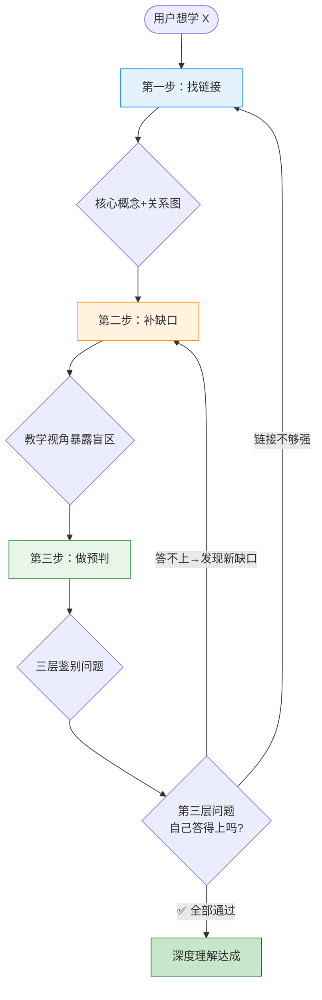

# Context Stacking 学习法

> 学习不是"堆信息"，而是"堆上下文"——每一层上下文为下一个概念提供理解的基础。

## 何时使用

当用户说"帮我学 **X**"、"**X** 是什么原理"、"学透 **X**"、"用正确的方法学习 **X**"——或者用户在学习过程中说"这个我好像懂了但说不清楚"时，启动此 Skill。

**三层触发强度**：
- 🟢 **强触发**：用户明确提到"Context Stacking"、"三步法"、"精深学习"
- 🟡 **中触发**：用户说"帮我学/理解/搞懂 **X**"、"学透"、"透彻理解"
- 🔵 **弱触发**：用户说"这个是什么"、"讲讲 **X**"——如果只是想要快速科普，不启动本 Skill；如果用户想系统学习，启动

---

## 核心流程：三步迭代法



---

### 第一步：找链接（Link）

**目标**：找出核心概念，建立概念之间的逻辑关系网。

**操作**：
1. **识别核心概念**：学完材料后，问"最核心的一个概念是什么？"——核心通常只有一个，其他是支撑或分支
2. **绘制概念关系图**（用 mermaid 或文本）：以核心为中心，标注：
   - `→` 直接支撑关系（A 是 B 的前提）
   - `≈` 类比映射关系（A 类似于 C，但区别是…）
   - `→→` 流程先后关系（A → B → C 的因果链）
3. **验证链接强度**：对每个链接问"如果 A 不成立，B 还会成立吗？"

**产出**：一张概念关系图，核心概念在中心。

---

### 第二步：补缺口（Gap-Fill）

**目标**：找到"教一个零基础的人前必须弄明白的事"。

**操作**：
1. **切换教学视角**：假装要教一个零基础的人，不是真教，是用来审视自己的理解
2. **逐层追问"为什么"**（每个概念三遍）：
   - 第一层：这是做什么的？（What）
   - 第二层：为什么需要它？（Why）
   - 第三层：它是怎么运作的？（How）
3. **标记缺口类型**：
   - 🏷️ **术语缺口**：某个词见过但说不清准确定义
   - 🔗 **逻辑缺口**："A → B"这一步想不通
   - 📦 **白盒缺口**：知道能用，但不知道内部原理
4. **定向补缺**：查一手资料 → 用自己的话重写解释 → 叠回关系图

**检验标准**：能用 5 分钟对一个零基础的人讲清概念，对方能复述 80% 核心内容。

---

### 第三步：做预判（Predict）

**目标**：设计出"能筛选出只懂表面、不懂底层逻辑的人"的问题。

**操作**：
1. **识别"表面学习者"特征**：能复述定义但不能解释原因；能列举场景但不能分析区别；能做对题但换表述就懵
2. **设计"三层鉴别"问题**：
   - 🟢 **第一层（记忆层）**：是什么？——筛掉完全没学过的
   - 🟡 **第二层（逻辑层）**：为什么？——筛掉只背了定义的
   - 🔴 **第三层（迁移层）**：换个场景会怎样？——筛出真懂底层逻辑的
3. **自检闭环**：对自己问出这些问题——如果第三层答不上，回到第二步

---

## 迭代机制（Skill 如何自我进化）

> 这个 Skill 本身是"活"的——每次使用都是对它的改进。

### 每次使用后记录

使用本 Skill 进行学习后，**在对话中记录**以下信息（不需要写文件，但要在对话中留痕，以便下次使用参考）：

```markdown
## 学习迭代记录
- 主题：学的是什么
- 第一步链接：核心概念和关键链接
- 第二步缺口：暴露了哪些缺口，怎么补的
- 第三步问题：设计了哪些鉴别问题
- 迭代发现：这次学习过程中，Context Stacking 方法本身有什么可以改进的地方？
```

### 方法本身的迭代方向

| 版本 | 改进方向 | 触发条件 |
|------|---------|---------|
| v1.0 | 初始版本 | - |
| v1.1 | 按学科类型差异化（技术 vs 金融 vs 人文） | 用户在特定领域重复使用后反馈 |
| v1.2 | 加入"记忆锚点"机制（类比/故事/图像） | 发现补缺口后还是容易忘 |
| v1.3 | 加入"输出检验"环节（让用户写 100 字小作文） | 发现预判题不够贴近实际运用 |
| v2.0 | 支持"多概念并联学习"（同时学多个相关概念） | 用户需要系统性学习整个领域 |

### 用户可主动发起的迭代

- 当用户说"这个方法不够好，因为…" → 记录问题，调整对应步骤
- 当用户说"能不能加一个步骤…" → 评估后加入，更新版本号
- 当用户说"这个方法帮我学透了 X" → 记录成功案例，提炼可复用的模式

---

## 参考文件

本 Skill 的参考文件位于 `references/` 目录，按需加载：

- **[方法完整版](./references/method-full.md)**：完整的三步法理论背景、与经典学习理论的关系、进阶技巧——只在用户想深入了解方法本身时加载
- **[案例库](./references/examples.md)**：各学科的应用案例——只在需要参考案例时加载
- **[迭代日志](./references/iteration-log.md)**：方法版本的演进记录——只在需要查看版本历史时加载

---

## 速查清单

每次学习结束时，确保以下内容被覆盖：

- [ ] **找链接**：核心概念是什么？与 3-5 个其他概念有什么逻辑关系？
- [ ] **补缺口**：如果教零基础的人，会卡在哪里？三层"为什么"能答上吗？
- [ ] **做预判**：设计了三层问题（🟢是什么→🟡为什么→🔴换场景）吗？自己能通过第三层吗？
- [ ] **迭代**：这次使用中，方法本身有什么改进想法？
