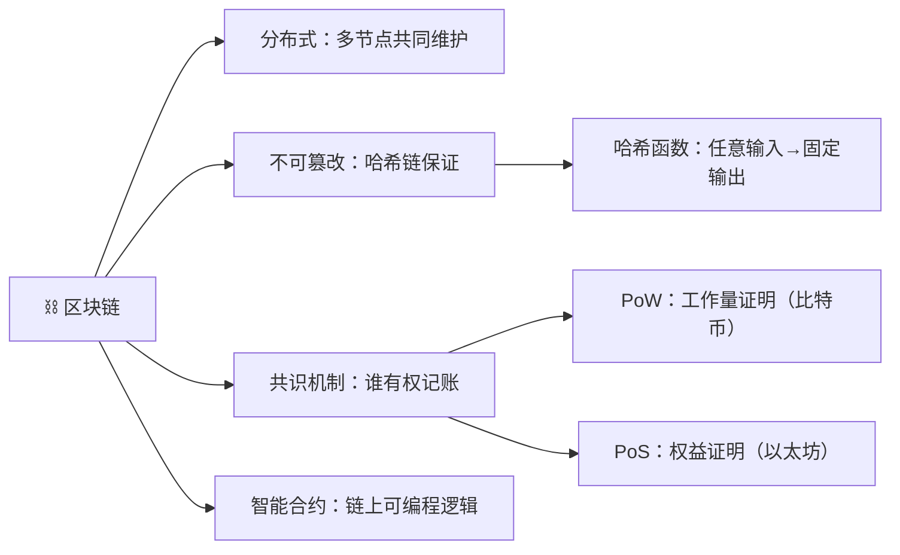

# 案例库

> 各学科应用案例，只在需要参考案例时加载。

---

## 案例 1：技术学习（区块链）

### 第一步：找链接

**核心概念**：区块链 = 一个**不可篡改的分布式账本**

### 第二步：补缺口

**假设教一个完全不懂的普通人：**

| 缺口 | 追问 | 补缺 |
|------|------|------|
| "分布式"到底是什么意思？ | 跟"去中心化"是一回事吗？ | 分布式是技术架构，去中心化是治理模式——分布式不必然去中心化 |
| 什么叫"不可篡改"？ | 数据库里改一条记录不是很简单吗？ | 每个区块包含前一个区块的哈希，改一个区块就要改后面所有区块，全网节点会拒绝 |
| 为什么需要"共识"？ | 一个人记账不行吗？ | 如果一个人记账，他就是银行——区块链要解决的是"没有可信第三方的情况下，大家怎么共同记账" |

### 第三步：做预判

- 🟢 **第一层**：区块链的英文全称是什么？
- 🟡 **第二层**：为什么区块链的"不可篡改"要靠哈希链，而不是靠法律约束？
- 🔴 **第三层**：如果我在联盟链（只有 10 个节点）上做区块链，那它还叫"区块链"吗？它和分布式数据库有什么区别？

---

## 案例 2：金融学习（利率）

### 第一步：找链接

**核心概念**：利率 = 资金的**时间价值**

### 第二步：补缺口

**假设教一个高中生：**

| 缺口 | 追问 |
|------|------|
| 为什么借 100 块要还 110 块？ | 因为今天 100 块比明年 100 块值钱 |
| 为什么今天更值钱？ | 因为今天 100 块可以拿去投资，一年后变成 >100 块 |
| 那如果没人需要借钱呢？ | 利率就降——所以利率本质是"资金的供需价格" |

### 第三步：做预判

- 🔴 **第三层**：如果央行把利率降到 0，甚至负利率，为什么企业反而不投资了？——触及"流动性陷阱"和经济学的底层假设

---

## 案例 3：销售/面试准备

### 第一步：找链接

**核心概念**：销售 = 在**客户决策链**上建立**信任**的过程

### 第二步：补缺口

**假设教一个刚入行的销售：**

| 缺口 | 追问 |
|------|------|
| 客户为什么要买？ | 因为有问题需要解决 |
| 为什么客户要信任你？ | 因为你理解他的问题，并且有解决方案 |
| 客户真的知道自己的问题吗？ | 不一定——好的销售能帮客户"发现"问题 |

### 第三步：做预判

- 🔴 **第三层**：如果客户说"我再考虑考虑"，这时候继续追问还是放弃？怎么判断是"真需要思考"还是"委婉拒绝"？
