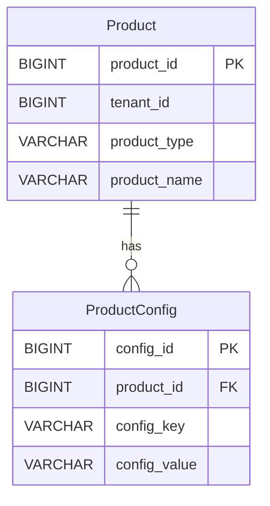
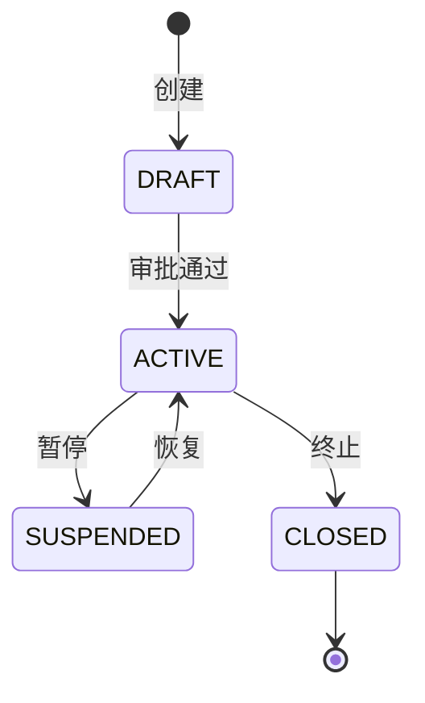
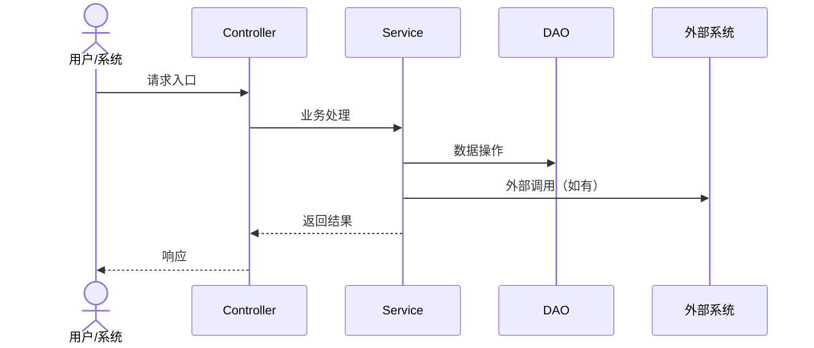

# 技术方案文档模板

> **用途**：新需求/变更的技术方案文档模板，覆盖从需求背景到发布兜底的全链路（按项目替换术语）。
> **AI 友好设计**：每个占位符均标注 `<!-- AI:填写指引 -->`，AI 可根据代码/配置/业务分析自动填充，无需人工逐项追问。
> **章节约定**：`[必填]` = 必须填写；`[选填]` = 有则填、无则标注"本期无"后跳过；`[AI-auto]` = AI 可从代码库自动推导。

---

## 一、需求背景

### 1.1 需求来源 `[必填]`

| 字段 | 值 |
|------|-----|
| 需求类型 | 新功能 / 功能变更 / Bug修复 / 性能优化 / 合规改造 |
| 优先级 | P0(紧急) / P1(高) / P2(中) / P3(低) |
| 目标上线日期 | <!-- AI:从需求文档或用户输入获取 --> |

#### 1.1.1 关联 PRD 与参考材料 `[必填]`

> **填写原则**：列出所有与本次需求相关的 PRD 文档、参考材料和设计稿，标注引用章节号。确保技术方案每个结论可溯源到一手 PRD，避免推断臆造。

| 关联说明 | 文档/材料 | 引用章节/说明 |
|---------|----------|-------------|
| <!-- 例如：核心需求 --> | <!-- 例如：RWA产品首页_PRD_v2.md --> | <!-- 例如：全文，或 §5.3 §6.4 --> |
| <!-- 例如：搜索共享口径 --> | <!-- 例如：RWA产品货架及产品详情_PRD_v2.md --> | <!-- 例如：§7.2 搜索匹配规则 --> |
| <!-- 例如：计算口径引用 --> | <!-- 例如：RWA持仓展示_PRD_v2.md --> | <!-- 例如：§7.2 总资产定义、§7.4 计算公式 --> |
| <!-- 例如：入口跳转目标 --> | <!-- 例如：RWA订单记录和订单详情_PRD_v2.md --> | <!-- 例如：金刚区"我的订单"入口 --> |
| <!-- 例如：多语言文案 --> | <!-- 例如：多语言/RWA产品首页多语言文案.md --> | <!-- 例如：16条不重复中文文案+3语言 --> |
| <!-- 例如：UI 参考稿 --> | <!-- 例如：assets/rwa-homepage.jpg --> | <!-- 例如：首页布局、搜索默认态、搜索结果态 --> |
| <!-- 例如：业务流程定位 --> | <!-- 例如：RWA业务全流程泳道图.md --> | <!-- 例如：首页位于"客户浏览与进入下单"环节 --> |
| <!-- 例如：旧版参考 --> | <!-- 例如：RWA产品首页需求文档.md --> | <!-- 例如：§13 埋点（v2移除但运营可能仍需） --> |

<!-- AI:从用户输入和需求分析文档(01-requirements.md)获取关联材料清单；无01文件时从用户输入提取。关联说明应简明概括该材料对本需求的贡献点，引用章节应精确到§编号 -->

### 1.2 需求概述 `[必填]`

<!-- AI:1-2段话概括需求核心目标，从需求文档提取。重点关注：业务价值、用户痛点、解决什么问题 -->

### 1.3 影响范围 `[必填]`

<!-- AI:从代码库分析涉及的模块/微服务。格式如下 -->

| 模块/微服务 | 变更类型 | 影响说明 |
|-------------|---------|---------|
| <!-- AI:auto:列出涉及的模块 --> | 新增/修改/无变更 | <!-- AI:auto:简要说明 --> |

### 1.4 术语表 `[选填]`

> 金融业务术语易混淆，首次出现需在此定义。

| 术语 | 定义 | 来源 |
|------|------|------|
| <!-- 例如：KO（Knock-Out） --> | <!-- 触发敲出事件，票据提前终止 --> | <!-- 产品说明书/业务规范 --> |

---

## 二、配置项变更

> **填写原则**：任何新增或修改的开发资源配置都必须在此登记，确保发布不遗漏、运维可追踪。
> **AI 可自动扫描**：代码中的 `@ConfigurationProperties`、Nacos 配置引用、Redis Key 定义、Topic 监听注解等来辅助填充。

### 2.1 数据库变更 `[必填]`

#### 2.1.1 DDL 变更 `[有则必填]`

<!-- AI:扫描代码中的 DDL/实体类变更，生成以下表格 -->

| 表名 | 变更类型 | 变更内容 | 影响评估 |
|------|---------|---------|---------|
| <!-- 例如：t_product_config --> | 新增表/加字段/改字段/删字段/加索引 | <!-- 具体DDL语句或描述 --> | <!-- 数据量/查询性能/兼容性 --> |

**DDL 脚本位置**：`<!-- 路径，如 db/migration/V20260709__xxx.sql -->`

#### 2.1.2 数据配置变更 `[有则必填]`

<!-- AI:扫描是否有数据初始化/迁移脚本 -->

| 配置项 | 变更内容 | 执行时机 | 备注 |
|--------|---------|---------|------|
| <!-- 例如：产品类型枚举新增RWA --> | <!-- 新增枚举值/配置数据 --> | <!-- 发布前/发布后/上线当天 --> | <!-- 是否需要数据迁移 --> |

### 2.2 Nacos 配置变更 `[有则必填]`

<!-- AI:扫描 @Value/@ConfigurationProperties/NacosConfigListener 引用 -->

| 配置 Key | 变更类型 | 原值 | 新值 | 所属 Data ID | 备注 |
|-----------|---------|------|------|-------------|------|
| <!-- 例如：wealth.product.rwa.enabled --> | 新增/修改/删除 | — | true | wealth-backend.yml | Feature Toggle |

### 2.3 消息监听 Topic `[有则必填]`

<!-- AI:扫描 @RocketMQMessageListener/KafkaListener/MQConsumer 注解 -->

| Topic | Tag/分区 | 消费组 | 变更类型 | 消息格式 | 上下游 |
|-------|---------|--------|---------|---------|--------|
| <!-- 例如：ORDER_CREATE_TOPIC --> | RWA | wealth-product-group | 新增消费 | <!-- JSON Schema 或引用 --> | 上游:订单中心 → 下游:本服务 |

### 2.4 Redis Key 变更 `[有则必填]`

<!-- AI:扫描代码中的 Redis Key 定义/Cacheable 注解 -->

| Key 模式 | 变更类型 | TTL | 用途 | 备注 |
|-----------|---------|-----|------|------|
| <!-- 例如：wealth:product:rwa:{productId} --> | 新增/修改 | 24h | 产品缓存 | 注意 Key 前缀隔离 |

### 2.5 定时任务变更 `[有则必填]`

<!-- AI:扫描 @Scheduled/XxlJob 注解 -->

| 任务名 | Cron 表达式 | 变更类型 | 用途 | 预估耗时 |
|--------|------------|---------|------|---------|
| <!-- 例如：rwa-nav-sync-job --> | 0 0 2 * * ? | 新增 | RWA净值同步 | ~5min |

### 2.6 分布式锁变更 `[有则必填]`

<!-- AI:扫描 @DistributedLock/RedisLock 注解或手动加锁代码 -->

| 锁 Key | 变更类型 | WaitTime / LeaseTime | 用途 | 备注 |
|--------|---------|---------------------|------|------|
| <!-- 例如：lock:order:create:{tenantId}:{orderId} --> | 新增/修改 | 5s / 30s | 防重复下单 | 注意租户隔离 |

### 2.7 其他资源配置 `[选填]`

<!-- 如：Feign 接口变更、外部API接入、文件存储路径等 -->

| 资源 | 变更内容 | 备注 |
|------|---------|------|
| <!-- 例如：新增 Feign 客户端 xxxApiClient --> | <!-- 接入地址/超时配置 --> | <!-- 灰度/全量 --> |

---

## 三、业务流程与领域模型

### 3.1 领域模型 `[必填]`

#### 3.1.1 核心实体关系 `[必填]`

<!-- AI:auto:从实体类/DO类推导核心实体关系，生成实体列表和关系描述 -->

**核心实体**：

| 实体 | 关键字段 | 与其他实体关系 | 变更说明 |
|------|---------|-------------|---------|
| <!-- 例如：Product --> | productId, productType, tenantId | → ProductConfig (1:N) | 新增 productType=RWA |

**实体关系图（ER Diagram）**：

<!-- AI:auto:可用 Mermaid 生成 ER 图，格式如下 -->


#### 3.1.2 字段变更明细 `[有则必填]`

| 实体/表 | 字段名 | 变更类型 | 类型 | 说明 |
|---------|--------|---------|------|------|
| <!-- 例如：Product --> | productType | 修改枚举范围 | VARCHAR(20) | 新增 RWA 类型值 |

#### 3.1.3 多租户隔离说明 `[必填]`

<!-- AI:auto:检查实体是否含 tenantId 字段，分析租户隔离策略 -->

| 实体 | 隔离字段 | 隔离策略 | 备注 |
|------|---------|---------|------|
| <!-- 例如：Product --> | tenant_id | 共享表+字段隔离 | 所有查询必须带 tenantId 条件 |

### 3.2 状态机 `[有则必填]`

<!-- AI:auto:从枚举类/状态转换代码推导状态机 -->

**状态定义**：

| 状态 | 状态码 | 含义 | 触发条件 |
|------|--------|------|---------|
| <!-- 例如：DRAFT --> | 10 | 草稿 | 产品创建 |
| <!-- 例如：ACTIVE --> | 20 | 生效 | 审批通过 |

**状态转换规则**：

| 从状态 → 目标状态 | 触发事件 | 前置条件 | 后置动作 |
|-------------------|---------|---------|---------|
| DRAFT → ACTIVE | 审批通过 | 资料齐全 | 发通知、开认购 |

**状态机图**：

<!-- AI:auto:可用 Mermaid 生成状态机图 -->


### 3.3 业务时序图 `[必填]`

<!-- AI:auto:从 Service/Controller 代码推导调用链，生成时序图 -->



### 3.4 上下游交互 `[必填]`

<!-- AI:auto:从 Feign/MQ/Event 代码推导上下游依赖 -->

| 方向 | 系统/服务 | 接口/Topic | 交互方式 | 数据格式 | 备注 |
|------|---------|-----------|---------|---------|------|
| 上游 | <!-- 例如：订单中心 --> | <!-- createOrder --> | Feign/MQ | <!-- JSON --> | <!-- 超时/重试策略 --> |
| 下游 | <!-- 例如：通知服务 --> | <!-- sendNotification --> | MQ | <!-- JSON --> | <!-- 异步解耦 --> |

---

## 四、接口设计

### 4.1 接口列表 `[必填]`

<!-- AI:auto:从 Controller 类推导接口列表 -->

| 接口 | Method | Path | 认证方式 | 说明 |
|------|--------|------|---------|------|
| <!-- 例如：创建RWA产品 --> | POST | /api/v1/product/rwa | Token | 新增 |

### 4.2 接口详情 `[必填]`

> 以下按每个新增/修改的接口逐一填写。

#### 4.2.1 `[接口名称]`

**基本信息**：

| 字段 | 值 |
|------|-----|
| 接口名称 | <!-- --> |
| Method | <!-- GET/POST/PUT/DELETE --> |
| Path | <!-- /api/v1/xxx --> |
| 认证方式 | <!-- Token/Session/无 --> |
| 是否幂等 | <!-- 是/否，说明幂等Key --> |

**请求参数**：

| 参数名 | 类型 | 必填 | 来源 | 说明 |
|--------|------|------|------|------|
| <!-- 例如：tenantId --> | Long | 是 | Header | 租户ID |

**响应结构**：

```json
{
  "code": 200,
  "message": "success",
  "data": {
    // <!-- AI:auto:从 VO/DTO 类推导字段 -->
  }
}
```

### 4.3 错误码表 `[必填]`

<!-- AI:auto:从 ErrorCode 枚举/常量类推导 -->

| 错误码 | HTTP Status | 含义 | 触发场景 | 用户提示 |
|--------|------------|------|---------|---------|
| <!-- 例如：PRODUCT_NOT_FOUND --> | 404 | 产品不存在 | 查询无效productId | "产品不存在，请检查产品编号" |
| <!-- 例如：TENANT_FORBIDDEN --> | 403 | 租户无权限 | 跨租户访问 | "无权限访问该资源" |

### 4.4 幂等约定 `[必填]`

<!-- AI:auto:从幂等注解/防重逻辑推导 -->

| 接口 | 幂等Key | 幂等策略 | 过期时间 |
|------|---------|---------|---------|
| <!-- 例如：创建订单 --> | orderId+tenantId | Redis SETNX | 24h |

---

## 五、监控与发布

### 5.1 监控指标 `[必填]`

<!-- AI:auto:从代码中的 Metrics/日志关键字推导 -->

| 指标 | 类型 | 采集方式 | 预警阈值 | 备注 |
|------|------|---------|---------|------|
| <!-- 例如：rwa_product_create_count --> | Counter | Prometheus | — | 新增产品计数 |
| <!-- 例如：rwa_nav_sync_latency --> | Gauge | Prometheus | >5s 告警 | 净值同步延迟 |

### 5.2 日志埋点 `[必填]`

| 日志 Key | 级别 | 位置 | 内容 | 备注 |
|-----------|------|------|------|------|
| <!-- 例如：RWA_PRODUCT_CREATE --> | INFO | ProductServiceImpl.create | 入参+结果 | 业务关键路径 |

### 5.3 灰度策略 `[选填]`

| 阶段 | 灰度范围 | 灰度方式 | 观察指标 | 回退条件 |
|------|---------|---------|---------|---------|
| <!-- 例如：灰度1 --> | 租户A | Feature Toggle | 错误率<1% | 错误率>5%或超时率>10% |
| <!-- 例如：全量 --> | 所有租户 | 全量发布 | 同上 | 同上 |

### 5.4 发布前置检查 `[必填]`

<!-- AI:auto:从配置变更和依赖关系推导 -->

| 序号 | 检查项 | 检查方式 | 备注 |
|------|--------|---------|------|
| 1 | DDL 已执行 | DBA确认 | <!-- 是否需要提前执行 --> |
| 2 | Nacos 配置已推送 | 运维确认 | <!-- 配置项列表 --> |
| 3 | 上下游接口已对齐 | 联调确认 | <!-- 依赖的上下游系统 --> |
| 4 | 数据配置已初始化 | DBA确认 | <!-- 是否需要数据迁移 --> |

### 5.5 回滚预案 `[必填]`

| 回滚场景 | 回滚方式 | 回滚步骤 | 数据回滚 | 影响评估 |
|---------|---------|---------|---------|---------|
| <!-- 例如：功能异常 --> | 版本回退 | 1.停流量 2.回退版本 3.验证 | <!-- DDL是否需回滚 --> | <!-- 回滚期间影响 --> |

---

## 六、边界情况与兜底处理

### 6.1 边界场景 `[必填]`

<!-- AI:auto:从代码中的边界判断/异常分支推导 -->

| 场景 | 触发条件 | 处理策略 | 影响范围 | 备注 |
|------|---------|---------|---------|------|
| <!-- 例如：重复提交 --> | 相同请求短时间重复 | 幂等拦截，返回已有结果 | 单租户 | 幂等Key设计 |
| <!-- 例如：净值数据缺失 --> | 外部净值接口超时 | 返回最近缓存值+提示 | 所有租户 | 降级策略 |
| <!-- 例如：并发创建产品 --> | 同租户同时创建 | 分布式锁排队 | 单租户 | 锁超时处理 |

### 6.2 降级与兜底 `[必填]`

| 依赖 | 降级条件 | 降级策略 | 恢复条件 | 影响 |
|------|---------|---------|---------|------|
| <!-- 例如：外部净值接口 --> | 连续3次超时/错误率>10% | 返回缓存值+数据时效标签 | 接口恢复正常 | 净值非实时 |

### 6.3 数据一致性保障 `[必填]`

| 一致性场景 | 保障机制 | 异常处理 | 补偿策略 |
|-----------|---------|---------|---------|
| <!-- 例如：订单创建与资产同步 --> | 本地消息表+定时补偿 | 记录失败日志+告警 | 定时任务重试，最多3次 |

### 6.4 重试与超时策略 `[必填]`

| 调用 | 超时时间 | 重试次数 | 重试间隔 | 退避策略 | 最终失败处理 |
|------|---------|---------|---------|---------|-------------|
| <!-- 例如：Feign→净值服务 --> | 3s | 2 | 1s | 固定间隔 | 返回缓存+告警 |

---

## 七、安全与合规

### 7.1 数据脱敏 `[有则必填]`

| 字段 | 脱敏规则 | 存储脱敏 | 展示脱敏 | 备注 |
|------|---------|---------|---------|------|
| <!-- 例如：客户姓名 --> | 姓名首字+** | 否 | 是 | 日志中也需脱敏 |
| <!-- 例如：身份证号 --> | 前3后4+*** | 否 | 是 | 查询需权限控制 |

### 7.2 权限控制 `[必填]`

| 操作 | 权限码 | 最小授权角色 | 租户隔离 | 备注 |
|------|--------|-------------|---------|------|
| <!-- 例如：创建RWA产品 --> | product:rwa:create | 产品经理 | 租户级 | 跨租户禁止操作 |

### 7.3 审计日志 `[必填]`

| 操作 | 记录内容 | 存储位置 | 保留期限 | 备注 |
|------|---------|---------|---------|------|
| <!-- 例如：产品状态变更 --> | 操作人+时间+原状态→新状态 | 审计表 | 5年 | 金融合规要求 |

### 7.4 KYC/AML 合规 `[选填]`

> 仅适用于涉及客户身份认证或反洗钱检查的场景。

| 合规要求 | 实现方式 | 触发时机 | 备注 |
|---------|---------|---------|------|
| <!-- 例如：客户身份验证 --> | 对接KYC服务 | 认购前 | 必须完成才能下单 |

### 7.5 安全评估 `[必填]`

| 评估项 | 结果 | 备注 |
|--------|------|------|
| SQL注入风险 | <!-- 无/已防范 --> | <!-- 参数化查询 --> |
| 越权访问风险 | <!-- 无/已防范 --> | <!-- tenantId隔离 --> |
| 数据泄露风险 | <!-- 无/已防范 --> | <!-- 脱敏规则 --> |
| 接口滥用风险 | <!-- 无/已防范 --> | <!-- 限流/幂等 --> |

---

## 附录

### A. Mermaid 渲染说明

本文档中的所有图（ER 图 / 状态机 / 时序图 / 流程图）统一使用 Mermaid 语法。渲染方式：
- GitLab / GitHub：内置支持 ```mermaid 代码块，直接预览
- VS Code 插件：`Markdown Preview Mermaid Support`
- IDEA 插件：`Mermaid`
- Typora：默认内置支持
- 在线渲染：[mermaid.live](https://mermaid.live)

> 约定：新增图表一律使用 Mermaid；历史 PlantUML 遗留文档在下次修订时顺手迁移。

### B. 文档变更记录

| 版本 | 日期 | 作者 | 变更说明 |
|------|------|------|---------|
| v1.0 | <!-- 日期 --> | <!-- 作者 --> | 初版 |

### C. 审阅记录

| 审阅人 | 角色 | 审阅日期 | 审阅结论 | 备注 |
|--------|------|---------|---------|------|
| <!-- 例如：张三 --> | 技术负责人 | <!-- --> | 通过/需修改 | <!-- --> |
